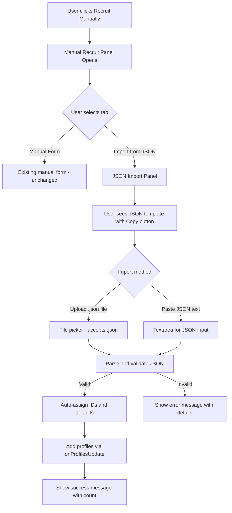

# Plan: JSON Import for Manual Recruit

## Overview

Add a JSON import option to the **"Recruit Manually"** section of the `ParticipantReview` component. Users will be able to:

1. **Upload a `.json` file** containing one or more consumer profiles
2. **Paste JSON text** directly into a textarea
3. **Copy a JSON template** from the UI to use as a starting point

All imported profiles will be validated against the `ConsumerProfile` type and added to the existing profiles list.

---

## Current Architecture

- **[`ConsumerProfile`](src/types/index.ts:1)** — The profile type with fields: `id`, `name`, `age`, `gender`, `location`, `income`, `education`, `lifestyle`, `interests`, `shoppingBehavior`, `techSavviness`, `environmentalAwareness`, `brandLoyalty`, `pricesensitivity`
- **[`ParticipantReview`](src/components/ParticipantReview.tsx:48)** — The component that displays recruited profiles and has a "Recruit Manually" form
- **[`addManualProfile()`](src/components/ParticipantReview.tsx:148)** — Existing function that adds a single manually-created profile
- **[`onProfilesUpdate()`](src/components/ParticipantReview.tsx:43)** — Callback prop that updates the parent's profile state

---

## Changes Required

### File: `src/components/ParticipantReview.tsx`

This is the **only file** that needs modification.

#### 1. New State Variables

Add state for the JSON import UI:

- `showJsonImport: boolean` — toggles the JSON import panel visibility
- `jsonText: string` — holds pasted JSON text
- `jsonError: string | null` — holds validation error messages
- `jsonImportSuccess: string | null` — holds success message after import

#### 2. New Icon Import

Add `FileJson`, `Copy`, `Upload` (or `ClipboardCopy`) from `lucide-react` for the UI buttons.

#### 3. JSON Template Constant

Define a constant `JSON_TEMPLATE` that contains a well-formatted example matching the `ConsumerProfile` type:

```json
[
  {
    "name": "Jane Smith",
    "age": 32,
    "gender": "Female",
    "location": "Urban",
    "income": "$50,000 - $75,000",
    "education": "Bachelor's degree",
    "lifestyle": "Health-conscious professional who values work-life balance",
    "interests": ["fitness", "cooking", "travel"],
    "shoppingBehavior": "Researches extensively before purchasing",
    "techSavviness": "High",
    "environmentalAwareness": "High",
    "brandLoyalty": "Medium",
    "pricesensitivity": "Medium"
  }
]
```

> Note: The `id` field is intentionally omitted from the template — it will be auto-generated on import.

#### 4. JSON Validation & Import Handler

Create a `handleJsonImport()` function that:

1. Parses the JSON string (from textarea or file)
2. Validates it's an array (or wraps a single object in an array)
3. Validates each profile has required fields (`name`, `lifestyle` at minimum — matching the existing manual form validation)
4. Assigns auto-generated `id` values (`json-import-{timestamp}-{index}`)
5. Sets sensible defaults for any missing optional fields
6. Calls `onProfilesUpdate([...profiles, ...importedProfiles])` to add them
7. Shows success/error feedback

#### 5. JSON File Upload Handler

Create a `handleJsonFileUpload()` function that:

1. Reads the uploaded `.json` file as text
2. Passes the text to the JSON validation/import handler

#### 6. Copy Template Handler

Create a `handleCopyTemplate()` function that copies the JSON template to the clipboard using `navigator.clipboard.writeText()`.

#### 7. UI Layout

Inside the existing **Manual Recruit Form** section (the `showManualRecruit` block), add a tabbed or toggle interface:

```
┌─────────────────────────────────────────────────┐
│  Recruit Participant Manually              [X]  │
│                                                  │
│  ┌──────────────┐  ┌──────────────────┐         │
│  │  Manual Form  │  │  Import from JSON │         │
│  └──────────────┘  └──────────────────┘         │
│                                                  │
│  (When "Import from JSON" tab is active:)       │
│                                                  │
│  ┌─ JSON Template ─────────────────────────┐    │
│  │  { ... template preview ... }            │    │
│  │                          [Copy Template] │    │
│  └──────────────────────────────────────────┘    │
│                                                  │
│  Upload JSON File:  [Choose File]               │
│                                                  │
│  — or paste JSON below —                        │
│                                                  │
│  ┌──────────────────────────────────────────┐    │
│  │  (textarea for pasting JSON)              │    │
│  └──────────────────────────────────────────┘    │
│                                                  │
│  [Error/Success message area]                   │
│                                                  │
│  [Cancel]                    [Import Profiles]  │
└─────────────────────────────────────────────────┘
```

---

## UI Flow Diagram



---

## Validation Rules

| Field | Required | Default if Missing |
|-------|----------|--------------------|
| `name` | Yes | — |
| `age` | No | `25` |
| `gender` | No | `"Prefer not to say"` |
| `location` | No | `"Urban"` |
| `income` | No | `"$50,000 - $75,000"` |
| `education` | No | `"Bachelor's degree"` |
| `lifestyle` | Yes | — |
| `interests` | No | `[]` |
| `shoppingBehavior` | No | `"Researches extensively before purchasing"` |
| `techSavviness` | No | `"Medium"` |
| `environmentalAwareness` | No | `"Medium"` |
| `brandLoyalty` | No | `"Medium"` |
| `pricesensitivity` | No | `"Medium"` |

---

## Summary of Changes

| File | Change |
|------|--------|
| [`src/components/ParticipantReview.tsx`](src/components/ParticipantReview.tsx) | Add JSON import tab, template display, file upload, text paste, validation, and import logic |

No new files, no type changes, no API changes needed. This is a purely frontend UI enhancement within a single component.
