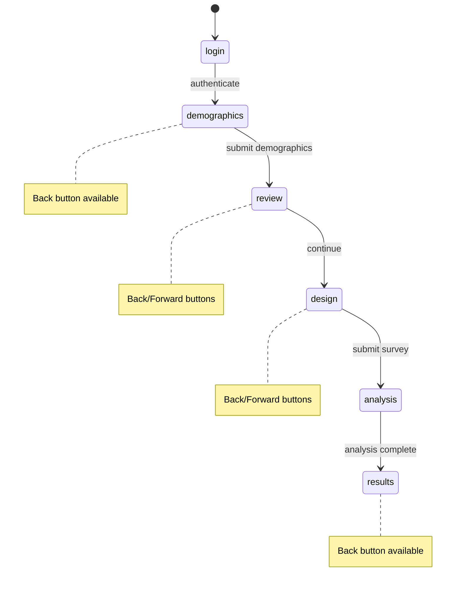

# Navigation: Back/Forward with State Preservation

## Problem
The app is a single-page wizard with steps: `login → demographics → review → design → analysis → results`. Currently navigation is forward-only. We need:
1. **Back button** — navigate to the previous step
2. **Forward button** — navigate forward if the user previously went back (like browser history)
3. **State preservation** — when going back and then forward, form contents should be preserved

## Approach: CSS Visibility with History Stack

Instead of conditionally rendering steps (`{currentStep === 'demographics' && <DemographicForm />}`), we keep all **visited** steps mounted in the DOM but hide non-active ones with `display: none`. This means:
- React state inside each component is naturally preserved (components never unmount)
- No need to lift form state up or modify component props
- Memory overhead is negligible for this app

### Navigation History
We track a `stepHistory` array and a `historyIndex` pointer:
- Going forward pushes to history
- Going back decrements the index
- Going forward after going back increments the index (if available)
- If the user goes back and then takes a NEW forward action (e.g., re-submits a form), we truncate the forward history



## Changes Required

### File: `src/app/page.tsx` (primary changes)

#### 1. Add navigation state
```typescript
// New state for tracking visited steps and navigation history
const [visitedSteps, setVisitedSteps] = useState<Set<Step>>(new Set(['login']));
const [stepHistory, setStepHistory] = useState<Step[]>(['login']);
const [historyIndex, setHistoryIndex] = useState(0);
```

#### 2. Create navigation helper functions
```typescript
// Navigate to a step (used by form submissions and explicit navigation)
const navigateToStep = (step: Step, isNewForwardAction = true) => {
  if (isNewForwardAction) {
    // Truncate any forward history and push new step
    const newHistory = [...stepHistory.slice(0, historyIndex + 1), step];
    setStepHistory(newHistory);
    setHistoryIndex(newHistory.length - 1);
  }
  setVisitedSteps(prev => new Set([...prev, step]));
  setCurrentStep(step);
};

const canGoBack = () => {
  // Can go back if not at the beginning of history and not on login
  return historyIndex > 0 && stepHistory[historyIndex] !== 'login';
};

const canGoForward = () => {
  // Can go forward if there is forward history
  return historyIndex < stepHistory.length - 1;
};

const goBack = () => {
  if (canGoBack()) {
    const newIndex = historyIndex - 1;
    setHistoryIndex(newIndex);
    setCurrentStep(stepHistory[newIndex]);
  }
};

const goForward = () => {
  if (canGoForward()) {
    const newIndex = historyIndex + 1;
    setHistoryIndex(newIndex);
    setCurrentStep(stepHistory[newIndex]);
  }
};
```

#### 3. Replace `setCurrentStep` calls with `navigateToStep`
All existing places that call `setCurrentStep` need to use `navigateToStep` instead:
- `handleDemographicsSubmit` → `navigateToStep('review')`
- `handleReviewContinue` → `navigateToStep('design')`
- `handleDesignSurveySubmit` → `navigateToStep('analysis')` then `navigateToStep('results')`
- `resetAnalysis` → reset all history state too
- Auth `useEffect` → `navigateToStep('demographics')` or reset to login

#### 4. Change rendering from conditional to CSS visibility
Replace:
```tsx
{currentStep === 'demographics' && (
  <DemographicForm ... />
)}
```
With:
```tsx
<div style={{ display: currentStep === 'demographics' ? 'block' : 'none' }}>
  {visitedSteps.has('demographics') && (
    <DemographicForm ... />
  )}
</div>
```
This ensures:
- Components are only created once they are first visited
- Once created, they stay mounted (preserving state)
- Only the active step is visible

**Special case: `analysis` step** — This is a transient loading step. It should NOT be preserved. It should use conditional rendering as before.

#### 5. Add Back/Forward navigation buttons
Add a navigation bar below the progress steps or at the bottom of the content area:
```tsx
{/* Navigation Buttons */}
<div className="flex justify-between items-center mt-6">
  <button
    onClick={goBack}
    disabled={!canGoBack() || isLoading}
    className="px-4 py-2 bg-gray-200 text-gray-700 rounded-lg hover:bg-gray-300 disabled:opacity-50 disabled:cursor-not-allowed flex items-center gap-2"
  >
    <ChevronLeft className="w-4 h-4" /> Back
  </button>
  <button
    onClick={goForward}
    disabled={!canGoForward() || isLoading}
    className="px-4 py-2 bg-gray-200 text-gray-700 rounded-lg hover:bg-gray-300 disabled:opacity-50 disabled:cursor-not-allowed flex items-center gap-2"
  >
    Forward <ChevronRight className="w-4 h-4" />
  </button>
</div>
```

#### 6. Make progress step indicators clickable
Completed steps in the progress bar should be clickable to navigate directly:
```tsx
<div 
  key={step} 
  className={`flex items-center ${isCompleted ? 'cursor-pointer' : ''}`}
  onClick={() => isCompleted && !isLoading ? navigateToStep(step as Step, false) : null}
>
```
Note: clicking a completed step should NOT truncate forward history — it should behave like back navigation. We need to handle this by adjusting the history index rather than pushing a new entry.

#### 7. Update `resetAnalysis`
```typescript
const resetAnalysis = () => {
  setCurrentStep('demographics');
  setDemographics(null);
  setProfiles([]);
  setConcepts([]);
  setQuestions([]);
  setAnalysisReport(null);
  // Reset navigation state
  setVisitedSteps(new Set(['login', 'demographics']));
  setStepHistory(['login', 'demographics']);
  setHistoryIndex(1);
};
```

## Edge Cases

| Scenario | Behavior |
|----------|----------|
| User is on `analysis` step (loading) | Back/Forward buttons disabled during loading |
| User goes back to `demographics` and re-submits | Forward history is truncated; new profiles generated; `review`/`design`/`results` components unmount since `visitedSteps` is reset for those |
| User goes back to `design` and re-submits | Forward history truncated from `analysis` onward; new analysis runs |
| User clicks completed step in progress bar | Navigates to that step without truncating forward history |
| User logs out | All state resets |
| `analysis` step | Always conditional render (transient loading state, not preservable) |

## Re-submission Handling

When a user goes back and re-submits a form, we need to:
1. Clear data from subsequent steps (since it is now stale)
2. Remove those steps from `visitedSteps` so components unmount and remount fresh
3. Truncate forward history

For example, if user goes back to `demographics` and re-submits:
```typescript
const handleDemographicsSubmit = async (demographicData: DemographicInput) => {
  // Clear downstream state
  setConcepts([]);
  setQuestions([]);
  setAnalysisReport(null);
  // Remove downstream from visited (so they remount fresh)
  setVisitedSteps(prev => {
    const next = new Set(prev);
    next.delete('design');
    next.delete('analysis');
    next.delete('results');
    return next;
  });
  // ... rest of existing logic, using navigateToStep('review') at the end
};
```

## Files Modified

| File | Changes |
|------|---------|
| `src/app/page.tsx` | Add navigation state, helper functions, CSS visibility rendering, back/forward buttons, clickable progress steps |

**No changes needed to child components** — this is the key advantage of the CSS visibility approach.

## Visual Layout

```
┌─────────────────────────────────────────────────┐
│  PULSE Header                          [Logout] │
├─────────────────────────────────────────────────┤
│  ○ Login → ● Demographics → ○ Review → ...      │  ← clickable completed steps
├─────────────────────────────────────────────────┤
│                                                  │
│  [← Back]              [Current Step]  [Forward →]│
│                                                  │
│  ... step content ...                            │
│                                                  │
├─────────────────────────────────────────────────┤
│  Footer                                          │
└─────────────────────────────────────────────────┘
```
