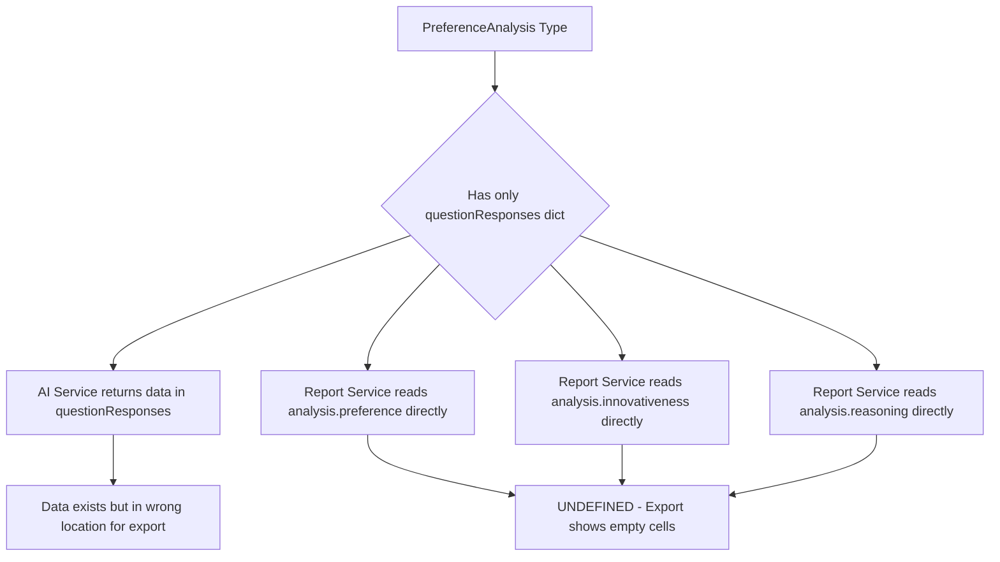
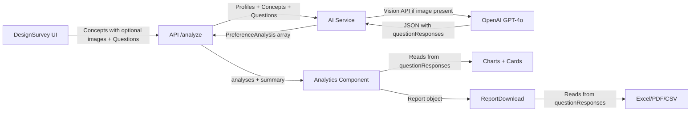

# Plan: Redesign Questions, Concept Images & Fix Excel Export

## Problem Summary

Three interconnected issues need to be addressed:

1. **Concept images**: Users need to upload optional images with concepts, and those images should be sent to the AI via vision API for analysis.
2. **Excel export broken**: The export code references `analysis.preference`, `analysis.innovativeness`, `analysis.differentiation`, and `analysis.reasoning` as direct properties, but the `PreferenceAnalysis` type only has `questionResponses` — a dictionary. The data is stored inside `questionResponses` but the export code tries to read it from the wrong place.
3. **AI prompt redesign**: The current prompt structure needs improvement for more reliable, structured JSON responses and better question handling.

---

## Root Cause Analysis: Excel Export Bug

The core data mismatch flows through the entire system:



### Specific broken references in `reportService.ts`:

| Line | Broken Reference | Should Be |
|------|-----------------|-----------|
| 67 | `report.summary.averagePreference` | Computed from `questionResponses.preference` |
| 68 | `report.summary.averageInnovativeness` | Computed from `questionResponses.innovativeness` |
| 69 | `report.summary.averageDifferentiation` | Computed from `questionResponses.differentiation` |
| 70 | `report.summary.topPerformingConcept` | Computed from question scores |
| 90-92 | `a.preference`, `a.innovativeness`, `a.differentiation` | `a.questionResponses.preference`, etc. |
| 217-219 | Same direct property access | Same fix needed |
| 259-269 | `analysis.preference`, `analysis.innovativeness`, etc. | Access via `questionResponses` |

### The `AnalysisReport.summary` type is also wrong:
The summary object created in `route.ts` line 123 only has `{ insights }`, but the report service expects `averagePreference`, `averageInnovativeness`, `averageDifferentiation`, and `topPerformingConcept`.

---

## Architecture Plan

### Phase 1: Fix the Data Model & Type Alignment

#### 1.1 Update `PreferenceAnalysis` type in `src/types/index.ts`

Keep `questionResponses` as the single source of truth. Remove any assumption of top-level `preference`/`innovativeness`/`differentiation`/`reasoning` properties.

```typescript
export interface PreferenceAnalysis {
  profileId: string;
  conceptId: string;
  questionResponses: { [questionId: string]: string | number | string[] };
}
```

This is already correct — the issue is that consumers of this type access properties that do not exist on it.

#### 1.2 Update `Concept` type to support optional image

```typescript
export interface Concept {
  id: string;
  title: string;
  description: string;
  imageBase64?: string;  // Optional base64-encoded image
  imageMimeType?: string; // e.g. 'image/png', 'image/jpeg'
}
```

#### 1.3 Update `AnalysisReport.summary` type

The summary should be computed dynamically from `questionResponses` rather than stored as fixed properties. Update the type:

```typescript
export interface AnalysisReport {
  id: string;
  timestamp: Date;
  demographics: DemographicInput;
  concepts: Concept[];
  profiles: ConsumerProfile[];
  analyses: PreferenceAnalysis[];
  summary: {
    insights: string[];
  };
  questions?: Question[];
}
```

This is already correct in the type definition — the issue is the report service assumes extra properties exist on `summary`.

---

### Phase 2: Fix Report Service (Excel/PDF/CSV Export)

#### 2.1 Create helper functions for score extraction

Add utility functions that safely extract scores from `questionResponses`:

```typescript
// Helper to get a numeric response from questionResponses
function getNumericResponse(analysis: PreferenceAnalysis, questionId: string): number {
  if (!analysis.questionResponses) return 0;
  const val = Number(analysis.questionResponses[questionId]);
  return isNaN(val) ? 0 : val;
}

// Helper to get string response
function getStringResponse(analysis: PreferenceAnalysis, questionId: string): string {
  if (!analysis.questionResponses) return '';
  const val = analysis.questionResponses[questionId];
  return Array.isArray(val) ? val.join(', ') : String(val || '');
}

// Helper to compute averages for a question across analyses
function computeAverage(analyses: PreferenceAnalysis[], questionId: string): number {
  const values = analyses.map(a => getNumericResponse(a, questionId)).filter(v => v > 0);
  return values.length > 0 ? values.reduce((s, v) => s + v, 0) / values.length : 0;
}
```

#### 2.2 Fix `generateExcelReport`

- **Summary sheet**: Compute `averagePreference`, `averageInnovativeness`, `averageDifferentiation` dynamically from `questionResponses`
- **Concepts Performance sheet**: Use `getNumericResponse` helper instead of `a.preference`
- **Detailed Analysis sheet**: Build columns dynamically from the questions list, reading from `questionResponses`
- **Questions sheet**: Already mostly correct, but needs the same helper functions

#### 2.3 Fix `generatePDFReport`

Same pattern — replace all direct property access with `questionResponses` lookups.

#### 2.4 Fix `generateCSVReport`

Same pattern — the CSV export already partially handles `questionResponses` but also references direct properties.

---

### Phase 3: Fix Mock Data Service

#### 3.1 Update `generateMockAnalyses` in `mockDataService.ts`

The mock service currently returns `PreferenceAnalysis` objects with `preference`, `innovativeness`, `differentiation`, and `reasoning` as top-level properties. These need to be moved into `questionResponses`:

```typescript
const analysis: PreferenceAnalysis = {
  profileId: profile.id,
  conceptId: concept.id,
  questionResponses: {
    preference: preference,
    innovativeness: innovativeness,
    differentiation: differentiation,
    rationale: reasoning,
  }
};
```

---

### Phase 4: Add Concept Image Upload

#### 4.1 Update `DesignSurvey` component

Add an image upload area to each concept card:
- File input accepting `image/png`, `image/jpeg`, `image/gif`, `image/webp`
- Image preview thumbnail
- Convert uploaded file to base64 using `FileReader`
- Store in concept state as `imageBase64` and `imageMimeType`
- Max file size limit (e.g., 5MB) since base64 will be sent in API calls

#### 4.2 Update concept state management

```typescript
const updateConceptImage = (id: string, base64: string, mimeType: string) => {
  setConcepts(concepts.map(concept =>
    concept.id === id ? { ...concept, imageBase64: base64, imageMimeType: mimeType } : concept
  ));
};
```

---

### Phase 5: Update AI Service for Vision + Better Prompts

#### 5.1 Vision API integration in `analyzePreferences`

When a concept has an `imageBase64`, use the OpenAI vision message format:

```typescript
const messages = [
  { role: 'system', content: systemPrompt },
  {
    role: 'user',
    content: [
      { type: 'text', text: promptText },
      ...(concept.imageBase64 ? [{
        type: 'image_url',
        image_url: {
          url: `data:${concept.imageMimeType};base64,${concept.imageBase64}`,
          detail: 'low'  // Use 'low' to reduce token cost
        }
      }] : [])
    ]
  }
];
```

All models in the rotation support vision — no model swaps needed (see Model Compatibility section below).

#### 5.2 Redesign AI prompt structure

Current issues with the prompt:
- The `questionResponsesExample` shows placeholder text like `(provide response based on type: scale_1_10)` which can confuse the model
- No explicit JSON schema enforcement
- The prompt mixes instructions with data

Improved prompt structure:

```
SYSTEM: You are a consumer research simulator. You embody consumer personas 
and provide their authentic reactions to product concepts. Always respond 
with valid JSON only.

USER:
## Task
Evaluate the following product concept from the perspective of each consumer 
profile below. For each profile, answer every survey question.

## Product Concept
Title: {title}
Description: {description}
[Image attached if available]

## Survey Questions
{for each question}
- ID: {id} | Question: {text} | Response Type: {type} | Instructions: {type-specific instructions}
{end for}

## Consumer Profiles
{for each profile in batch}
Profile ID: {id}
Demographics: {age}yo {gender}, {location}, {income}, {education}
Psychographics: {lifestyle}, interests in {interests}
Behaviors: {shoppingBehavior}, tech: {techSavviness}, eco: {environmentalAwareness}
{end for}

## Required Response Format
Return a JSON array. Each element must match this exact schema:
{
  "profileId": "string - the profile ID",
  "conceptId": "{conceptId}",
  "questionResponses": {
    "{questionId1}": <number for scale questions, string for open_ended>,
    "{questionId2}": <number for scale questions, string for open_ended>,
    ...
  }
}

## Response Type Rules
- scale_1_5: integer from 1 to 5
- scale_1_10: integer from 1 to 10  
- open_ended: string with 1-3 sentences from the consumers perspective
- rank_order: array of concept IDs in preference order
```

---

### Phase 6: Optimize DesignSurvey UI

#### 6.1 Layout improvements
- Use a two-column layout: concepts on the left, questions on the right
- Add image preview with drag-and-drop upload zone
- Better visual hierarchy with section headers
- Collapsible concept cards for when there are many concepts

#### 6.2 Question management improvements
- Drag-and-drop reordering of questions
- Inline editing of question text
- Better visual distinction between scale and open-ended questions
- Show response type with icons instead of just text

---

## Data Flow After Changes



---

## Files to Modify

| File | Changes |
|------|---------|
| `src/types/index.ts` | Add `imageBase64?` and `imageMimeType?` to `Concept` |
| `src/components/DesignSurvey.tsx` | Add image upload UI, layout redesign |
| `src/services/aiService.ts` | Vision API support, prompt redesign |
| `src/services/reportService.ts` | Fix all export methods to use `questionResponses` |
| `src/services/mockDataService.ts` | Fix mock data to use `questionResponses` format |
| `src/components/Analytics.tsx` | Verify all score computations use `questionResponses` (mostly already correct) |
| `src/app/api/analyze/route.ts` | Pass concept images through to AI service |

---

## Model Compatibility Verification

The current models used in [`aiService.ts`](src/services/aiService.ts:185) for the analysis rotation are:

| Model | In Supported List? | Vision Support |
|-------|-------------------|----------------|
| `grok-3` | Yes | PNG, JPEG |
| `gpt-4o-mini` | Yes | PNG, JPEG, WebP, GIF |
| `gpt-5-nano` | Yes | PNG, JPEG, WebP, GIF |
| `claude-sonnet-4` | Yes | JPEG, PNG, GIF, WebP |

**Fallback model**: `gpt-4o` — Yes, supports PNG, JPEG, WebP, GIF
**Insights model**: `gpt-4o` — Yes, supports PNG, JPEG, WebP, GIF

**All current models support vision/image input via both base64 and URL methods.** No model swaps needed.

**Image format constraint**: Since `grok-3` only supports PNG and JPEG, we should either:
- Restrict uploads to PNG and JPEG only, OR
- Accept PNG, JPEG, WebP, GIF but convert WebP/GIF to PNG client-side before base64 encoding

**Recommendation**: Accept PNG, JPEG, WebP, and GIF uploads but convert WebP/GIF to PNG client-side using canvas, ensuring `grok-3` compatibility across the model rotation.

---

## Implementation Order

1. **Fix types** — Update `Concept` interface with image fields
2. **Fix mock data service** — Use `questionResponses` format
3. **Fix report service** — All three export methods to read from `questionResponses`
4. **Fix AI prompt** — Restructure for reliability
5. **Add vision support** — Image in AI calls using multimodal messages
6. **Add image upload UI** — DesignSurvey component with preview and base64 conversion
7. **UI polish** — Layout optimization
