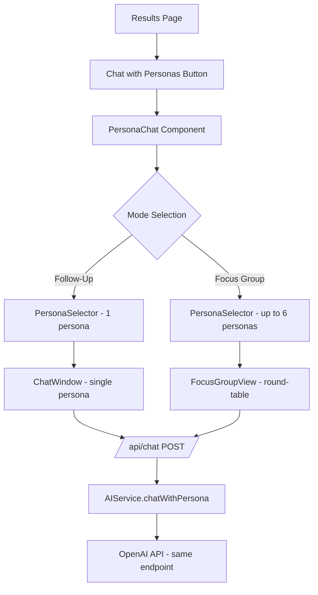

# Results Page Redesign & Persona Chat Feature

## Overview

Two major changes to the PULSE application:

1. **Results Page Redesign** — Make the results dashboard modular with per-question summary cards, remove the radar chart, and add an average score comparison across concepts.
2. **Persona Chat Feature** — Allow users to chat with selected consumer personas after the survey, with two modes: "Follow-Up Questions" (1 persona) and "Focus Group" (up to 6 personas).

---

## Part 1: Results Page Redesign

### Current State

The current [`Analytics.tsx`](src/components/Analytics.tsx:1) is a single 670-line monolithic component containing:
- Demographics filter panel (lines 336–528)
- Summary cards for scale questions (lines 531–585)
- Radar chart for overall performance (lines 594–599) — **to be removed**
- Question analysis with dropdown selector (lines 602–653)
- Key insights section (lines 657–667)

### Target Architecture

Break [`Analytics.tsx`](src/components/Analytics.tsx:1) into a modular dashboard with extracted sub-components:

```
src/components/results/
├── DemographicFilterPanel.tsx   # Extracted filter UI
├── ConceptComparisonTable.tsx   # NEW: Average score comparison table
├── QuestionSummaryCard.tsx      # NEW: Per-question module with chart + stats
├── InsightsPanel.tsx            # Extracted insights section
└── index.ts                    # Barrel export
```

The refactored [`Analytics.tsx`](src/components/Analytics.tsx:50) becomes a layout orchestrator that composes these modules.

### New Results Layout

```
┌─────────────────────────────────────────────────┐
│  Demographics Filter Panel (collapsible)         │
├─────────────────────────────────────────────────┤
│  Concept Comparison Table                        │
│  ┌──────────┬──────────┬──────────┬──────────┐  │
│  │ Concept  │ Avg Score│ Q1 Avg   │ Q2 Avg   │  │
│  ├──────────┼──────────┼──────────┼──────────┤  │
│  │ Concept A│  7.2     │  8.1     │  6.3     │  │
│  │ Concept B│  6.8     │  7.5     │  6.1     │  │
│  └──────────┴──────────┴──────────┴──────────┘  │
├─────────────────────────────────────────────────┤
│  Per-Question Summary Cards (scrollable)         │
│  ┌─────────────────────────────────────────────┐│
│  │ Q1: Preference (1-10 Scale)                 ││
│  │ Overall Avg: 7.4 | Bar chart by concept     ││
│  │ [Concept A: 8.1] [Concept B: 7.5] ...      ││
│  └─────────────────────────────────────────────┘│
│  ┌─────────────────────────────────────────────┐│
│  │ Q2: Innovativeness (1-10 Scale)             ││
│  │ Overall Avg: 6.8 | Bar chart by concept     ││
│  └─────────────────────────────────────────────┘│
│  ┌─────────────────────────────────────────────┐│
│  │ Q3: Rationale (Open Ended)                  ││
│  │ Response count: 45 | Sample responses        ││
│  └─────────────────────────────────────────────┘│
├─────────────────────────────────────────────────┤
│  Key Insights Panel                              │
├─────────────────────────────────────────────────┤
│  Report Download                                 │
├─────────────────────────────────────────────────┤
│  💬 Chat with Personas (button/section)          │
└─────────────────────────────────────────────────┘
```

### Component Details

#### `DemographicFilterPanel.tsx`
- Extracted from current filter code in [`Analytics.tsx`](src/components/Analytics.tsx:336)
- Props: `profiles`, `filters`, `onFilterChange`, `onClearFilters`
- No logic changes, just extraction

#### `ConceptComparisonTable.tsx` (NEW)
- A table showing each concept as a row
- Columns: Concept Name, Overall Average Score, then one column per enabled scale question
- Sortable by any column
- Highlights the top-performing concept
- Uses `filteredAnalyses` data

#### `QuestionSummaryCard.tsx` (NEW)
- One card per enabled question
- For scale questions: shows overall average, bar chart comparing concepts, min/max/median stats
- For open-ended questions: shows response count, word cloud or sample responses grouped by concept
- Each card is self-contained with its own data computation

#### `InsightsPanel.tsx`
- Extracted from current insights code in [`Analytics.tsx`](src/components/Analytics.tsx:657)
- Props: `insights: string[]`
- No logic changes, just extraction

---

## Part 2: Persona Chat Feature

### Architecture Overview



### Chat Modes

#### Mode 1: Follow-Up Questions
- User selects **1 persona** from the generated consumer profiles
- Standard chat interface: user types question, persona responds
- Context includes: the personas full profile, all survey responses for all concepts, the concepts themselves
- The AI responds in-character as that specific consumer

#### Mode 2: Focus Group
- User selects **up to 6 personas** from the generated consumer profiles
- Round-table discussion format
- When user asks a question, each selected persona responds in sequence
- If user addresses a specific persona by name, only that persona responds
- Each response is labeled with the personas name and avatar/initials
- Context includes: all selected personas profiles, their survey responses, and the concepts

### New Types

Add to [`src/types/index.ts`](src/types/index.ts:1):

```typescript
export type ChatMode = 'follow_up' | 'focus_group';

export interface ChatMessage {
  id: string;
  role: 'user' | 'persona';
  personaId?: string;      // which persona is speaking
  personaName?: string;    // display name
  content: string;
  timestamp: Date;
}

export interface ChatSession {
  mode: ChatMode;
  selectedPersonas: ConsumerProfile[];
  messages: ChatMessage[];
  surveyContext: SurveyContext;
}

export interface SurveyContext {
  concepts: Concept[];
  questions: Question[];
  analyses: PreferenceAnalysis[];  // filtered to selected personas only
}
```

### New Components

#### `PersonaChat.tsx` — Main Container
- Located at `src/components/PersonaChat.tsx`
- Props: `report: AnalysisReport`
- Manages chat state: mode, selected personas, messages
- Renders mode toggle, persona selector, and chat window
- Builds the invisible survey context prompt

#### `chat/PersonaSelector.tsx`
- Shows grid of available consumer profiles with key info (name, age, gender, location)
- In follow-up mode: single select (radio-style)
- In focus group mode: multi-select with max 6 limit, shows count
- Search/filter by name or demographics
- Selected personas highlighted with checkmark

#### `chat/ChatWindow.tsx`
- Used for follow-up mode (single persona)
- Standard chat UI: message list + input box
- Messages show user on right, persona on left with avatar/initials
- Loading indicator while waiting for AI response
- Auto-scroll to latest message

#### `chat/FocusGroupView.tsx`
- Used for focus group mode (multi-persona)
- Shows persona avatars/names at top as participants
- Messages in a timeline format with persona name labels
- When user sends a message, triggers sequential API calls for each persona
- Shows typing indicators for each persona as they respond
- If user message contains a personas name, only that persona responds

### API Route: `/api/chat`

New file at `src/app/api/chat/route.ts`:

```typescript
// POST /api/chat
// Body: {
//   message: string,
//   personaProfile: ConsumerProfile,
//   surveyContext: SurveyContext,
//   conversationHistory: ChatMessage[],
//   mode: ChatMode
// }
// Response: { response: string, personaId: string }
```

- Uses the same OpenAI client from [`aiService.ts`](src/services/aiService.ts:8)
- Builds a system prompt that includes:
  1. The personas full demographic profile
  2. All concepts tested in the survey
  3. The personas survey responses for each concept
  4. Instructions to stay in character
- The survey context is invisible to the user (system prompt) but provides grounding for authentic responses
- For focus group mode, the client makes sequential calls for each persona

### AI Service Addition

Add to [`AIService`](src/services/aiService.ts:13) class:

```typescript
static buildPersonaSystemPrompt(
  profile: ConsumerProfile,
  surveyContext: SurveyContext
): string {
  // Builds the invisible context prompt including:
  // - Full persona profile
  // - Concepts they evaluated
  // - Their specific responses to each question for each concept
  // - Instructions to respond authentically as this person
}

static async chatWithPersona(
  message: string,
  profile: ConsumerProfile,
  surveyContext: SurveyContext,
  conversationHistory: Array<{role: string, content: string}>
): Promise<string> {
  // Makes OpenAI API call with persona system prompt + conversation history
}
```

### Survey Context Building

The invisible prompt sent to the AI will look like:

```
You are {name}, a {age}-year-old {gender} from {location}.

YOUR BACKGROUND:
- Income: {income}
- Education: {education}
- Lifestyle: {lifestyle}
- Interests: {interests}
- Shopping behavior: {shoppingBehavior}
- Tech savviness: {techSavviness}
- Environmental awareness: {environmentalAwareness}
- Brand loyalty: {brandLoyalty}
- Price sensitivity: {pricesensitivity}

YOU RECENTLY PARTICIPATED IN A CONSUMER SURVEY. Here is what you evaluated:

CONCEPT 1: "{title}"
Description: "{description}"
Your responses:
- {question1}: {response1}
- {question2}: {response2}
...

CONCEPT 2: "{title}"
...

Respond naturally as this person. Stay in character. Reference your survey
responses when relevant. Be authentic to your demographic profile.
```

### Focus Group Name Detection

In focus group mode, before sending to all personas, the client checks if the users message mentions a specific personas name:

```typescript
const mentionedPersona = selectedPersonas.find(p => 
  message.toLowerCase().includes(p.name.toLowerCase().split(' ')[0].toLowerCase())
);

if (mentionedPersona) {
  // Only send to that persona
} else {
  // Send to all personas sequentially
}
```

---

## Integration Points

### `page.tsx` Changes

The results step in [`page.tsx`](src/app/page.tsx:420) currently renders:
```tsx
<Analytics report={analysisReport} />
<ReportDownload report={analysisReport} />
```

It will be updated to:
```tsx
<Analytics report={analysisReport} />
<ReportDownload report={analysisReport} />
<PersonaChat report={analysisReport} />
```

The [`PersonaChat`](src/components/PersonaChat.tsx) component handles its own state and can be collapsed/expanded.

---

## File Change Summary

| File | Action | Description |
|------|--------|-------------|
| `src/types/index.ts` | Modify | Add ChatMessage, ChatMode, ChatSession, SurveyContext types |
| `src/components/Analytics.tsx` | Refactor | Break into modular sub-components, remove radar chart, add concept comparison |
| `src/components/results/DemographicFilterPanel.tsx` | Create | Extracted filter panel |
| `src/components/results/ConceptComparisonTable.tsx` | Create | Average score comparison table |
| `src/components/results/QuestionSummaryCard.tsx` | Create | Per-question summary module |
| `src/components/results/InsightsPanel.tsx` | Create | Extracted insights panel |
| `src/components/results/index.ts` | Create | Barrel exports |
| `src/components/PersonaChat.tsx` | Create | Main chat container with mode toggle |
| `src/components/chat/PersonaSelector.tsx` | Create | Persona selection UI |
| `src/components/chat/ChatWindow.tsx` | Create | Single-persona chat interface |
| `src/components/chat/FocusGroupView.tsx` | Create | Multi-persona round-table view |
| `src/app/api/chat/route.ts` | Create | Chat API endpoint |
| `src/services/aiService.ts` | Modify | Add buildPersonaSystemPrompt and chatWithPersona methods |
| `src/app/page.tsx` | Modify | Add PersonaChat to results step |

---

## Technical Considerations

1. **Streaming vs Non-streaming**: Start with non-streaming responses for simplicity. Can add streaming later for better UX.
2. **Token limits**: The survey context prompt could be large with many profiles/concepts. Limit conversation history to last 20 messages and summarize older context.
3. **Rate limiting**: Focus group mode makes up to 6 sequential API calls per user message. Add appropriate loading states.
4. **No new dependencies needed**: Uses existing `openai` package and Tailwind CSS for styling.
5. **Conversation persistence**: Chat state lives in React state only (no database). Refreshing the page loses the conversation.
